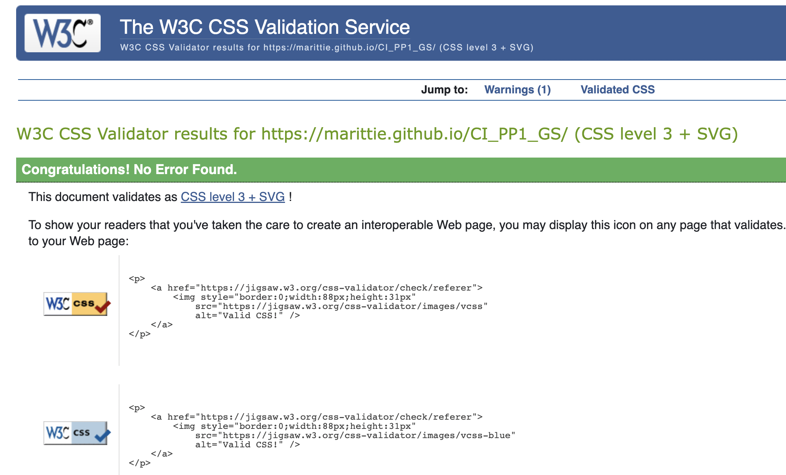
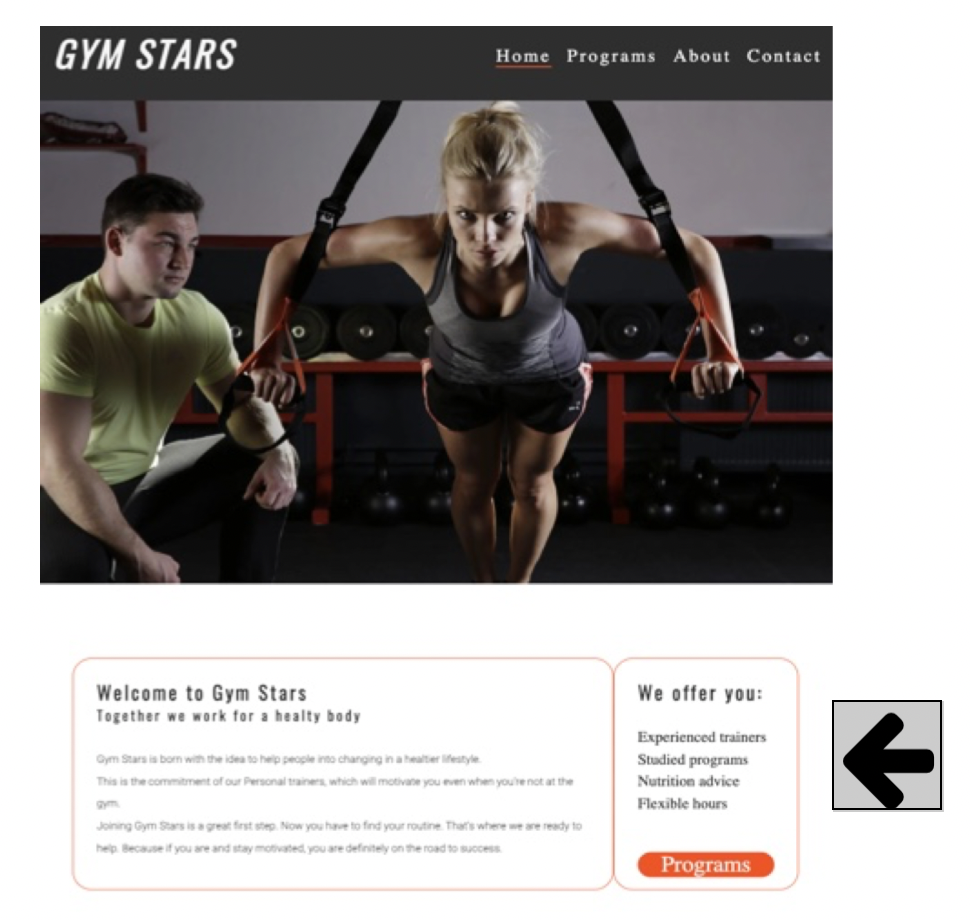

# Gym Stars
(Developer: Mario Castaldo)

[Live webpage]( https://marittie.github.io/CI_PP1_GS/)

## Table of Content

1. [Project Goals](#project-goals)
    1. [User Goals](#user-goals)
    2. [Site Owner Goals](#site-owner-goals)
2. [User Experience](#user-experience)
    1. [Target Audience](#target-audience)
    2. [User Requrements and Expectations](#user-requrements-and-expectations)
    3. [User Stories](#user-stories)
3. [Design](#design)
    1. [Design Choices](#design-choices)
    2. [Colour](#colours)
    3. [Fonts](#fonts)
    4. [Structure](#structure)
    5. [Wireframes](#wireframes)
4. [Technologies Used](#technologies-used)
    1. [Languages](#languages)
    2. [Frameworks & Tools](#frameworks-&-tools)
5. [Features](#features)
6. [Testing](#validation)
    1. [HTML Validation](#HTML-validation)
    2. [CSS Validation](#CSS-validation)
    3. [Accessibility](#accessibility)
    4. [Performance](#performance)
    5. [Device testing](#performing-tests-on-various-devices)
    6. [Browser compatibility](#browser-compatability)
    7. [Testing user stories](#testing-user-stories)
8. [Deployment](#deployment)
9. [Credits](#credits)
10. [Acknowledgements](#acknowledgements)

## Project Goals 

### User Goals
- A gym that offers different training programs.
- See the training programmes and prices.
- Find information about the Gym.
- Find the location of the restaurant

### Site Owner Goals
- Increase in the number of clients.
- Promote the bussines.
- Provide a way for new customers to contact the buissnes.
- Provide essential information about the bussines to customers.

## User Experience

### Target Audience
- People looking to have a healtier life style.
- People looking to be assisted by personal trainers.
- People looking for flexible hours.
- People looking for nutrition advice.

### User Requrements and Expectations

- A simple and intuitive navigation system.
- Quickly and easily find relevant information.
- Links and functions that work as expected.
- Good presentation and a visually appealing design regardless of screen size.
- An easy way to contact the business.
- Simple content that the user can skim read.
- Accessibility.

### User Stories

#### First-time User 
1. As a first time user, I want to know where the gym is lokated.
2. As a first time user, I want to know the price range.
3. As a first time user, I want to know about the opening hours.
4. As a first time user, I want to know what services the gym offers.
5. As a first time user, I want to get in touch with the gym about the programmes.

#### Returning User
6. As a returning user, I want to see the price range.
7. As a returnign user, I want to know the opening times.
8. As a returning user, I want to find the gym on social media.
9. As a returning user, I want to get directions to the gym.

#### Site Owner 
10. As the site owner, I want users to see the programs we offer.
11. As the site owner, I want user to see that the opening hours are flexible.
12. As the site owner, I want users to get to know about Gym Stars.
13. As the site owner, I want the users to be able to contact us.

## Design

### Design Choices
I gave the website a design that wants to look modern, tidy and eye-pleasing to the users being easy to navigate.

### Colour
I have given the website a contrast of shades of gray, black and shades of orange as a light orange color as background for some texts and an orangered, a dark orange color for borders and buttons. I choose the orange because from a marketing point of view it is seen as healthy, energized and attention grabbing.

### Fonts
Oswald was used for the logo and the headings and Roboto for the paragraphs. I chose these fonts because they are considered attractive and amenable. 

### Structure
The page is structured in an easy user friendly way. Upon arriving at the website the user sees a familiar type of navigation bar with the gym logo on the left side and the navigation links to the right.
The website consists of four separate pages:
- A homepage with a hero image, a welcome section and the location of the gym.
- A programme page with the training programmes offered.
- An about page with the ‘Why Gym Stars’.
- A contact page with a contact form to ask questions or leave a message.

### Wireframes

Home

Program

About

Contact

## Technologies Used

### Languages
- HTML
- CSS

### Frameworks & Tools
- Git
- GitHub
- Gitpod
- Balsamiq
- Google Fonts
- Font Awesome

## Features

- __Navigation Bar__
 
* Featured on all the pages, the navigation bar includes links to the Logo, Home page, Programs page, About and contact page and it is identical in each page. When the user hovers over the links the line underneath the text is white and it will stay red when the user is on the page.
Clicking on the logo would bring the user to the home page.
This feature allows the user to navigate between the different pages without having to press the browsers back or forward navigation.

 
- __The Main Image__
 
* The main image of the website represents a female athlete training under the assistance of one of the personal trainers with the motivational quote right at the center of the image.
The image zooms in everytime the page is opened.
 

 
- __Why Gym Start__
 
* The ‘Why Gym Stars’ is a first introduction of the website giving  the user a reason to get interested about it.
A ‘Programs’ button will take the user to see the programmes Gym Stars offers.
* User stories covered: 12
 

 
- __The Map__
 
* I placed a Map showing the address to the user.
* User stories covered: 1, 9.
 

 
- __The Footer__
 
* The footer includes links to social media sites and the copyright for the website. I added Facebook, Instagram and Twitter for the user to interact with the posts uploaded by Gym Stars, and You Tube for the user to have a look of the workout videos. The links will open to a new tab for easier navigation.
I have added the noopener value to all links for a safer navigation.
* User stories covered: 8
 

 
- __Programmes Page__
 
This section is to give to the user navigating on the Gym Stars website an insight of whom could be a the potential clients and showing the four different programmes available.
When hovering on the images showing the different programmes, the images zooms out to give to the user a better sight of the image itself. 
 

 
- __Prices__
 
There are three different prices according to the length of the subscription to give to the user different choices.
 

 
- __Contact button__
 
I placed a button to direct the user to the contact page to having the user to contact us to be adviced about the programmes and the intake prosiges.
 

 
- __About Page__
 
The about  page gives the user a little bit more information about the inclusive values of Gym Stars.
 

 
- __Contact Page__
 
The contact page wants to give the user the chance to get in touch with the personal trainers in order to choose the workout programme that best suits the new potential client and to send to the user  the information about the intake.
 

- __404 Error page__

The error page is built showing the main image of the home page and the text with the 404 error and the path to follow to redirect the user to the working website.

## Validation

### HTML Validation
The W3C Markup Validation Service was used to validate the HTML of the website. All pages pass with no errors no warnings to show.

Home

Programs

About

Contact

404

### CSS Validation
The W3C Jigsaw CSS Validation Service was used to validate the CSS of the website.

Whole

### Accessibility
The WAVE WebAIM web accessibility evaluation tool was used to ensure the website met high accessibility standards. All pages pass with 0 errors.

Home

Programs

About

Contact

### Performance 
Google Lighthouse in Google Chrome Developer Tools was used to test the performance of the website. 

Home

Program

About

Contact

### Performing tests on various devices 
The website was tested on the following devices:
- Iphone 7
- Iphone 13 Pro
- Samsuns S20 Ultra
In addition, the website was tested using Google Chrome Developer Tools Device Toggeling option for all available device options.

### Browser compatability
The website was tested on the following browsers:
- Google Chrome
- Safari
- Mozilla Firefox

### Testing user stories

1. As a first time user, I want to know where the gym is located

| **Feature** | **Action** | **Expected Result** | **Actual Result** |
|-------------|------------|---------------------|-------------------|
| Home | Navigate to the bottom of the page, locate the Google Map | Locating a map showing the location of the restaurant | Works as expected |

Screenshots

2. As a first time user, I want to know the price range

| **Feature** | **Action** | **Expected Result** | **Actual Result** |
|-------------|------------|---------------------|-------------------|
| Menu | Navigate to the Programme page | See prices on the programme page | Works as expected |

Screenshots

3. As a first time user, I want to know more about the opening hours

| **Feature** | **Action** | **Expected Result** | **Actual Result** |
|-------------|------------|---------------------|-------------------|
| Home | Navigate to the Home page | Find opening hours of the gym | Works as expected |

Screenshots

4. As a first time user, I want to know what services the gym offers.

| **Feature** | **Action** | **Expected Result** | **Actual Result** |
|-------------|------------|---------------------|-------------------|
| Home | Navigate to the Home page and locate the 'We offer' section | Find what the gym offers | Works as expected |

Screenshots

5. As a first time user, I want to get in touch with the gym about the programmes.

| **Feature** | **Action** | **Expected Result** | **Actual Result** |
|-------------|------------|---------------------|-------------------|
| Menu | Navigate to the Programme page | Find contact button at the bottom of the page | Works as expected |
| Menu | Navigate to the Contact page | Find contact form on the page | Works as expected |

Screenshots

6. As a returning user, I want to see the price range.

| **Feature** | **Action** | **Expected Result** | **Actual Result** |
|-------------|------------|---------------------|-------------------|
| Menu | Navigate to the Programme page | See prices on the programme page | Works as expected |

Screenshots

7. As a returnign user, I want to know the opening times.

| **Feature** | **Action** | **Expected Result** | **Actual Result** |
|-------------|------------|---------------------|-------------------|
| Home | Navigate to the Home page | Find opening hours of the gym | Works as expected |

Screenshots

8. As a returning user, I want to find the gym on social media.

| **Feature** | **Action** | **Expected Result** | **Actual Result** |
|-------------|------------|---------------------|-------------------|
| Footer - social media section | On any page scroll to the bottom | Click on social media links | Works as expected | 

Screenshots

9. As a returning user, I want to get directions to the gym.

| **Feature** | **Action** | **Expected Result** | **Actual Result** |
|-------------|------------|---------------------|-------------------|
| Home | Navigate to the bottom of the page, locate the Google Map | Locating a map showing the location of the restaurant | Works as expected |

Screenshots

10. As the site owner, I want users to see the programmes we offer.

| **Feature** | **Action** | **Expected Result** | **Actual Result** |
|-------------|------------|---------------------|-------------------|
| Home | Navigate to the Home page and locate the 'We offer' section with the button to the programs | Find what the gym offers | Works as expected | 
| Home | Navigate to the Program page | Find the four programmes offered | Works as expected

Screenshots

11. As the site owner, I want user to see that the opening hours are flexible.

| **Feature** | **Action** | **Expected Result** | **Actual Result** |
|-------------|------------|---------------------|-------------------|
| Home | Navigate to the Home page | Find opening hours of the gym | Works as expected |

Screenshots

12. As the site owner, I want users to get to know about Gym Stars.

| **Feature** | **Action** | **Expected Result** | **Actual Result** |
|-------------|------------|---------------------|-------------------|
| Home | Navigate to the About page | Find 'Why Gym Stars' on the page | Works as expected |

Screenshots

13. As the site owner, I want the users to be able to contact us.

| **Feature** | **Action** | **Expected Result** | **Actual Result** |
|-------------|------------|---------------------|-------------------|
| Menu | Navigate to the Programme page | Find contact button at the bottom of the page to direct user to the contact form | Works as expected |
| Menu | Navigate to the Contact page | Find contact form on the page | Works as expected |

Screenshots

## Deployment
The website was deployed using GitHub Pages by following these steps:
1. In the GitHub repository navigate to the Settings tab
2. On the left hand menu select Pages
3. For the source select Branch: master
4. After the webpage refreshes automaticaly you will se a ribbon on the top saying: "Your site is published at https://marittie.github.io/CI_PP1_GS/ 

## Credits

### Media
All the photos used are from https://www.pexels.com/

### Code
- I watched videos by Kevin Powell on YouTube about media query.
- I got inspired by the Love Running Project about the round images on the home page and the about page.
- I utilized the website w3schools.com for the style of the contact form.

## Acknowledgements
I would like to take the opportunity to thank:
- The Tutors for the incredible support. 
- My fellow students on the slack community for the code reviews.
- My Mentor Mo Shami for giudance, support and advice.
- My girlfriend and my friends for feedbacks and support.